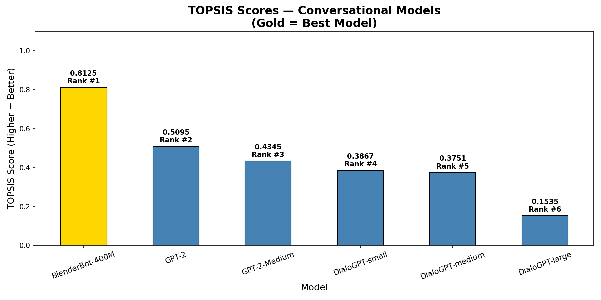
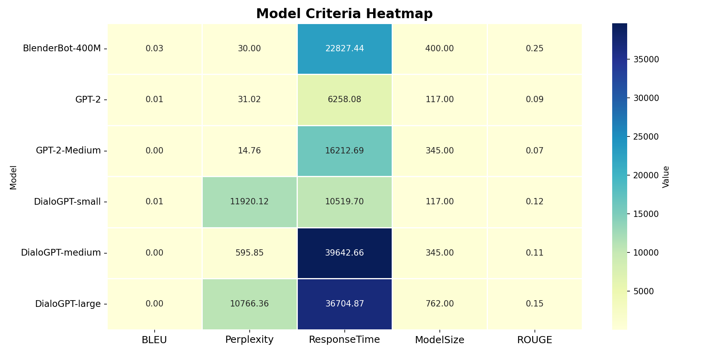
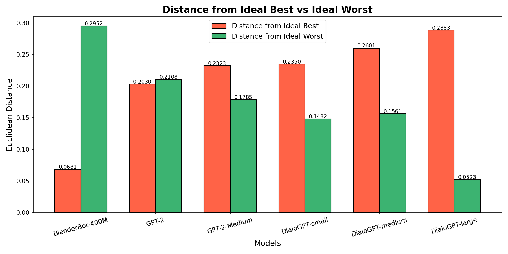

# TOPSIS Analysis — Text Conversational Models

## 📌 Objective
To evaluate and rank pre-trained conversational AI models 
using the TOPSIS (Technique for Order of Preference by 
Similarity to Ideal Solution) multi-criteria decision 
making method.

## 🤖 Models Compared
| Model | Size (MB) |
|-------|-----------|
| DialoGPT-small | 117 |
| DialoGPT-medium | 345 |
| DialoGPT-large | 762 |
| BlenderBot-400M | 400 |
| GPT-2 | 117 |
| GPT-2-Medium | 345 |

## 📊 Evaluation Criteria
| Criteria | Impact | Weight | Reason |
|----------|--------|--------|--------|
| BLEU Score | + Higher is Better | 0.25 | Measures response quality |
| Perplexity | - Lower is Better | 0.20 | Lower = better language understanding |
| Response Time (ms) | - Lower is Better | 0.20 | Faster response = better |
| Model Size (MB) | - Lower is Better | 0.15 | Smaller = more efficient |
| ROUGE Score | + Higher is Better | 0.20 | Measures overlap with reference |

## 🏆 Final TOPSIS Ranking
| Rank | Model | BLEU | Perplexity | Response Time | Model Size | ROUGE | TOPSIS Score |
|------|-------|------|------------|---------------|------------|-------|--------------|
| 1 | BlenderBot-400M | 0.0322 | 30.00 | 22827ms | 400MB | 0.2533 | 0.8125 |
| 2 | GPT-2 | 0.0070 | 31.02 | 6258ms | 117MB | 0.0917 | 0.5095 |
| 3 | GPT-2-Medium | 0.0041 | 14.76 | 16212ms | 345MB | 0.0683 | 0.4345 |
| 4 | DialoGPT-small | 0.0091 | 11920.12 | 10519ms | 117MB | 0.1227 | 0.3867 |
| 5 | DialoGPT-medium | 0.0016 | 595.85 | 39642ms | 345MB | 0.1133 | 0.3751 |
| 6 | DialoGPT-large | 0.0034 | 10766.35 | 36704ms | 762MB | 0.1538 | 0.1535 |

## 📈 Graphs

### TOPSIS Scores


### Criteria Heatmap


### Distance Chart


## 🔍 Conclusion
Based on TOPSIS analysis across 5 evaluation criteria,
**BlenderBot-400M** emerged as the best pre-trained 
conversational model with the highest TOPSIS score of 
**0.8125**.

### Key Findings:
- **BlenderBot-400M** achieved the highest ROUGE score 
  (0.2533) and maintained low perplexity (30.0), making 
  it the most balanced and coherent conversational model.
- **GPT-2** ranked 2nd due to its small size (117MB) and 
  fast response time, making it efficient despite lower 
  quality scores.
- **DialoGPT models** ranked poorly due to extremely high 
  perplexity values (595–11920), indicating poor language 
  understanding on the given test inputs.
- **DialoGPT-large** ranked last despite being the biggest 
  model — proving that larger size does not always mean 
  better performance.


## 🛠️ Tools & Libraries Used
- Python 3
- HuggingFace Transformers
- NLTK (BLEU Score)
- rouge-score (ROUGE Score)
- NumPy, Pandas
- Matplotlib, Seaborn


Manya Singh
Thapar Institute of Engineering & Technology
UCS654 — Predictive Analytics
```

---


